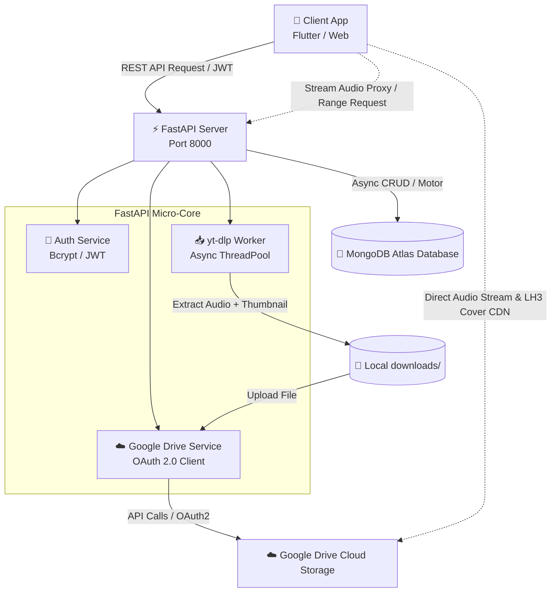

# 📜 PROJECT.md - Đặc tả & Kiến trúc Hệ thống Music Storage

Tài liệu này cung cấp cái nhìn toàn diện về tầm nhìn sản phẩm, kiến trúc hệ thống, mô hình dữ liệu và các quyết định kỹ thuật cốt lõi của dự án **Music Storage**.

---

## 🎯 1. Tầm nhìn & Mục tiêu Dự án

### 1.1. Bối cảnh
Các ứng dụng nghe nhạc truyền thống hoặc giải pháp tự host (self-hosted streaming) thường gặp phải các rào cản lớn:
- Chi phí lưu trữ file âm thanh và video trên các máy chủ đám mây (AWS S3, Google Cloud Storage, DigitalOcean Spaces) tăng theo cấp số nhân khi thư viện mở rộng.
- Băng thông tải xuống (egress bandwidth) đắt đỏ khi streaming media dung lượng lớn trực tiếp từ server ứng dụng.
- Khó khăn trong việc tìm kiếm và đồng bộ nhạc từ các nguồn phổ biến như YouTube về bộ sưu tập cá nhân.

### 1.2. Giải pháp
**Music Storage** giải quyết bài toán trên bằng mô hình kiến trúc lai (Hybrid Cloud Model):
- **FastAPI Backend**: Xử lý logic nghiệp vụ, quản lý phiên làm việc, tìm kiếm và điều phối tải file.
- **MongoDB**: Đóng vai trò là kho lưu trữ Metadata cực nhẹ (tên bài, nghệ sĩ, thời lượng, phân loại, quan hệ sở hữu).
- **Google Drive**: Được tận dụng như một Content Delivery Network (CDN) & Media Storage miễn phí (15GB/tài khoản), cung cấp đường dẫn Direct Stream URL tốc độ cao và ổn định.

---

## 🏛 2. Kiến trúc Hệ thống Tổng thể



### 2.1. Phân luồng dòng chảy dữ liệu (Data Flows)

#### A. Luồng Đăng ký & Cấp phát Thư mục (Registration Flow):
1. Client gửi thông tin người dùng (`username`, `password`, `email`, `full_name`).
2. Server băm mật khẩu bằng thuật toán `bcrypt` an toàn.
3. Server gọi `Google Drive Service`:
   - Tìm hoặc tạo thư mục gốc `Music Storage`.
   - Tạo một thư mục riêng biệt đặt tên theo `full_name` (hoặc `username`) của người dùng nằm bên trong `Music Storage`.
   - Cấp quyền đọc công khai (Public Read) cho thư mục này để các file con thừa hưởng quyền truy cập.
4. Lưu bản ghi người dùng vào collection `users` kèm theo `drive_folder_id`.

#### B. Luồng Tải Nhạc từ YouTube (YouTube Ingestion Flow):
1. Client gửi URL video YouTube và token xác thực JWT.
2. FastAPI ủy quyền tác vụ tải nặng cho thread pool (`asyncio.to_thread`) để không block Event Loop:
   - `yt-dlp` nạp cấu hình `js_runtimes` (node, deno) cùng cookies Netscape đã được chuẩn hóa (loại bỏ BOM UTF-8) từ `YOUTUBE_COOKIES` hoặc file `cookies.txt` để vượt tường lửa bot detection.
   - Gọi `FFmpeg` để trích xuất stream âm thanh tốt nhất sang định dạng MP3 bitrate 192kbps.
   - Trích xuất và tải file ảnh thumbnail của bài hát.
   - Làm sạch ký tự đặc biệt trong tên bài hát (`sanitize_filename`).
3. Tạo thư mục con mang tên bài hát bên trong thư mục Google Drive của người dùng.
4. Đẩy song song (`asyncio.gather`) cả file `.mp3` và file `_thumb.jpg` vào thư mục con trên Drive.
5. Lấy mã định danh Google Drive ID (`drive_file_id`, `cover_drive_file_id`) và lưu metadata vào collection `songs` trong MongoDB.
6. Xóa các file tạm cục bộ trong thư mục `downloads/` để giải phóng ổ đĩa.

#### C. Luồng Phát Nhạc Trực Tuyến & Tải Ảnh Bìa (Streaming & Cover Delivery):
1. **Phát trực tiếp (Direct Stream)**: Client nhận URL stream từ Drive hoặc gọi Audio Proxy `GET /api/songs/{id}/stream`. Proxy hỗ trợ Range Header (`Accept-Ranges: bytes`) giúp client có thể tua (seek) tự do tới bất kỳ phân đoạn nào mà không phải tải toàn bộ file.
2. **Ảnh bìa tốc độ cao (LH3 CDN)**: API tự động sinh link Google CDN `https://lh3.googleusercontent.com/d/{cover_id}` hoặc qua endpoint `GET /api/songs/{id}/cover` có gán `Cache-Control` và hỗ trợ đầy đủ CORS cho Web/Mobile.

---

## 🗄 3. Mô hình Dữ liệu (Database Schema)

### 3.1. Collection `users`
Lưu trữ thông tin người dùng và liên kết thư mục Google Drive cá nhân:
```json
{
  "_id": ObjectId("67028bfa1234567890abcdef"),
  "username": "sutie",
  "email": "sutie@example.com",
  "password_hash": "$2b$12$e8Y7z7Kq... (bcrypt hash)",
  "full_name": "SutieXuXi",
  "drive_folder_id": "18Y_oEaTsC-c6me4PUXw5c1slgOJfOgTr",
  "is_active": true,
  "created_at": ISODate("2026-10-06T10:00:00Z"),
  "updated_at": ISODate("2026-10-06T10:00:00Z")
}
```

### 3.2. Collection `songs`
Lưu trữ thông tin metadata bài hát và mã định danh (ID) trên Google Drive (Tuyệt đối không lưu URL tĩnh, toàn bộ URL phát nhạc/ảnh bìa được sinh động ở tầng API):
```json
{
  "_id": ObjectId("6ac4e4ececc87a7b1e612838"),
  "title": "NO COMPASSO",
  "artist": "defectivekid",
  "album": "YouTube",
  "genre": "YouTube",
  "duration": 89,
  "format": "mp3",
  "file_size": 2146796,
  "drive_file_id": "1LEKJq3Bc-dBmL4ir9h7dI_pIFagF48P8",
  "thumbnail_drive_file_id": "1QZ4QiGTLxJcxsjticoz44V4FNr8P3K1s",
  "user_id": "6ac4e088fed15528ccd07ba1",
  "user_username": "sutie",
  "created_at": ISODate("2026-10-06T12:09:16.532Z")
}
```
> **Lưu ý tầng API (Serializer Response):** Khi Client gọi `GET /api/songs` hoặc `GET /api/songs/{id}`, Backend sẽ tự động ghép các ID trên thành các URL hoàn chỉnh (`download_url`, `stream_url`, `web_view_link`, `cover_url`) để Client có thể phát nhạc và tải ảnh bìa trực tiếp mà Database vẫn tinh gọn 100%.


---

## 💡 4. Các Quyết định Kỹ thuật Then chốt (Key Architectural Decisions)

| Quyết định | Lựa chọn | Lý do & Lợi ích |
|---|---|---|
| **Web Framework** | FastAPI (Python) | Hỗ trợ async/await nguyên bản, tự động sinh Swagger OpenAPI docs, validation dữ liệu mạnh mẽ với Pydantic v2. |
| **Driver Cơ sở dữ liệu** | Motor (Async MongoDB) + `certifi` | Tương thích hoàn hảo với async event loop của FastAPI. Sử dụng `certifi.where()` đảm bảo bắt tay TLS/SSL thông suốt tới MongoDB Atlas trên cả Windows và Linux. |
| **Lưu trữ Media** | Google Drive API (OAuth 2.0) | Sử dụng tài khoản cá nhân có 15GB miễn phí. Dùng `InstalledAppFlow` kết hợp Refresh Token giúp duy trì kết nối vĩnh viễn mà không lo hết hạn. |
| **Phân phối Media (Delivery)** | Dual Delivery (Direct LH3 + Proxy Range) | Trực tiếp qua Google LH3 CDN cho ảnh bìa; hỗ trợ Audio Proxy với Range Request (`Accept-Ranges: bytes`) giúp ứng dụng Flutter tua bài mượt mà. |
| **Tối ưu Media** | Chỉ lưu MP3 (192kbps) + Thumbnail JPEG | Giảm 90% dung lượng so với việc lưu video MP4 đầy đủ. Tối ưu thời gian upload lên Drive và tốc độ load cho thiết bị di động. |
| **Mã hóa Mật khẩu** | Thư viện `bcrypt` trực tiếp | Loại bỏ `passlib` để tránh lỗi xung đột 72-byte truncation và lỗi tương thích với các phiên bản `bcrypt >= 4.1.0`. |
| **Cấu trúc File Drive** | Cây 2 cấp: `User` -> `Song` | Ngăn nắp, dễ quản lý, dễ dàng phân quyền hoặc di chuyển/backup từng bài hát hoặc từng người dùng. |

---

## 🗺 5. Lộ trình Phát triển (Roadmap)

### Giai đoạn 1: Nền tảng cốt lõi (Đã hoàn thành)
- [x] Khởi tạo FastAPI Server, kết nối Motor MongoDB.
- [x] Module Authentication: Đăng ký, đăng nhập, JWT tokens, bảo mật mật khẩu.
- [x] Tự động tạo thư mục Google Drive theo `full_name` của người dùng.
- [x] Module YouTube Downloader: Trích xuất MP3 192k và thumbnail.
- [x] Tổ chức thư mục 2 cấp trên Drive và lưu trữ metadata vào MongoDB.
- [x] API Quản lý bài hát (Danh sách, Chi tiết, Xóa có kiểm tra quyền).

### Giai đoạn 2: Quản lý Danh sách & Tương tác (Kế hoạch tiếp theo)
- [ ] Tính năng **Playlists**: Tạo danh sách phát, thêm/xóa bài hát khỏi playlist.
- [ ] Tính năng **Favorites**: Đánh dấu bài hát yêu thích.
- [x] Trích xuất hoặc lấy lời bài hát (Lyrics / LRC file) tự động (hỗ trợ LRCLIB & YouTube Captions).
- [ ] Hỗ trợ đa dạng nguồn tải ngoài YouTube (SoundCloud, ZingMP3).

### Giai đoạn 3: Tối ưu Hóa & Vận hành Quy mô lớn
- [ ] Tích hợp **Redis Cache** cho danh sách bài hát và thông tin user.
- [ ] Áp dụng Background Task Worker (Celery hoặc Redis Queue) cho tác vụ tải nhạc nặng nhằm tăng khả năng chịu tải của API.
- [ ] Hỗ trợ chuyển vùng lưu trữ dự phòng (Cloudflare R2 hoặc MinIO).

### Giai đoạn 4: Ứng dụng Client (Đã hoàn thành phiên bản v1.0)
- [x] Xây dựng ứng dụng hoàn chỉnh bằng **Flutter** (`mobile_ui`): hỗ trợ Web, Android, iOS, Windows.
- [x] Thiết kế phong cách Terminal Cyberpunk độc đáo với bộ icon Reicon đồng bộ.
- [x] Tích hợp phát nhạc nền với `just_audio`, hiển thị sóng âm DSP 60fps và thanh điều khiển Mini Player.
- [x] Trải nghiệm chuyển động cao cấp: vuốt kéo tương tác trực tiếp (Interactive pull-to-dismiss), buffering indicator tức thì, chuyển đổi trạng thái đăng nhập điện ảnh.
- [ ] Tính năng tải bộ nhớ đệm ngoại tuyến (Offline Caching) cho Client di động.
